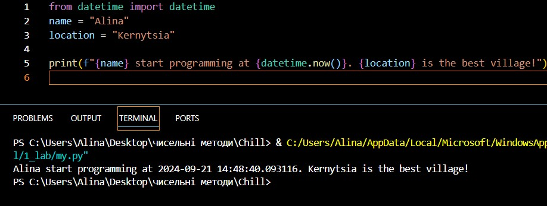
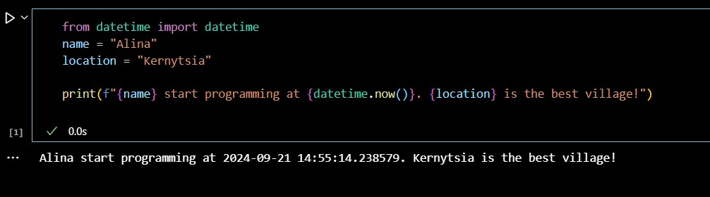
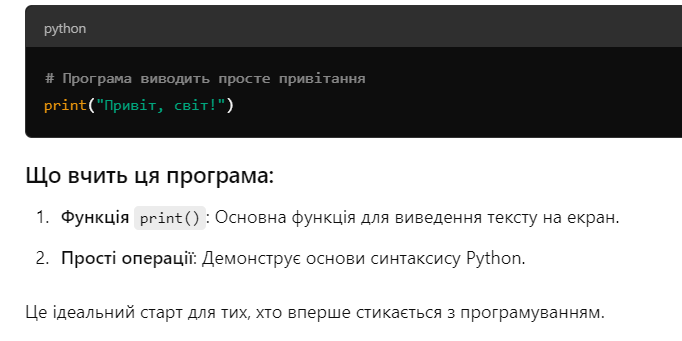

# Звіт до роботи 1
## Тема: Вступ
### Мета роботи: налаштувати середовище, створити репозиторій, попрацювати з Markdown та оформити звіт

---
### Виконання роботи
* Результати виконання завдань:
    1. Репозиторій створено, ;

    2. Навчилась працювати з репозиторієм та налаштували інтеграцію з Visual Studio Code;

    3. Написала першу програму та запустила її. Програма вивела текст представлений на скріншоті:
    

    4. Створила Пайтон Ноутбук та виконалf тестову програму в ньому. Програма надрукувала те що представлено на скріншоті:
    

    5. Навчилась працювати з Пайтоном, запускати програми та оформлювати звіти;

* Результат що видав ChatGPT представлений на скриншоті:
  

---
### Висновок:
> у висновку потрібно відповісти на запитання:
- :question: Що зроблено в роботі;
    Кучу всього (насправді ознайомлення з базою в пітоні)
- :question: Чи досягнуто мети роботи;
    Так!
- :question: Які нові знання отримано;
   Ну код читати я вміла до цього, а от писати його трохи тяжко
- :question: Чи вдалось відповісти на всі питання задані в ході роботи;
    Ну поки питань не виникало
- :question: Чи вдалося виконати всі завдання;
  Якщо я нічого не пропустил, тоді так
- :question: Чи виникли складності у виконанні завдання;
    Ні
- :question: Чи подобається такий формат здачі роботи (Feedback);
 Так
- :question: Побажання для покращення (Suggestions);
Хотілося б трошки відео-уроку? Бо я в тексті гублюсь і краще сприймаю на слух

